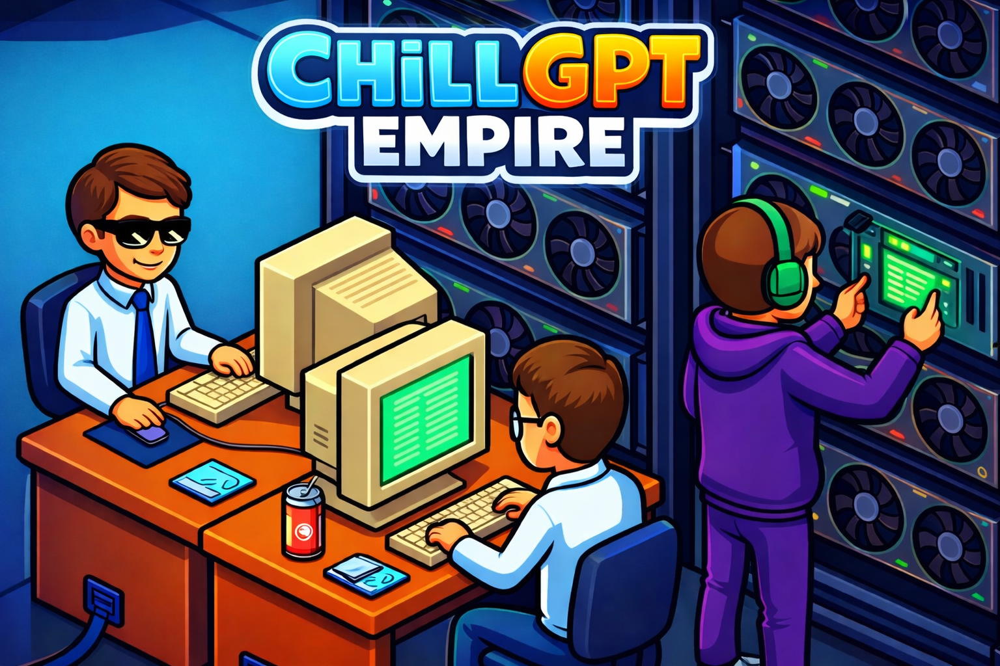

# ⚡ ChillGPT Empire



> **"Build the world's chillest and most powerful AI — from a garage in 2016 to global domination by 2026."**

**ChillGPT Empire** is a deep-tech idle tycoon game built for the **Gamedev.js Jam 2026**. Experience the evolution of artificial intelligence, manage massive GPU clusters, survive the electricity bills of a national data center, and dominate the Global AI Arena.

---

## 🏆 Gamedev.js Jam 2026 Challenges

This project is a proud entry for the **Gamedev.js Jam 2026** under the theme **"MACHINES"**. We have integrated several cutting-edge technologies to participate in the following challenges:

### 📖 [Open Source Challenge by GitHub](https://gamedevjs.com/jam/2026/#challenge-opensource)
The entire source code for **ChillGPT Empire** is open-source and available on GitHub. We believe in the "Open AI" philosophy (the real kind) where the community can audit, learn from, and contribute to the world's chillest machine intelligence.
*   **Repository:** [github.com/khushalsolanki001/chillgpt-empire](https://github.com/khushalsolanki001/chillgpt-empire)

### 🕹️ [Build it with Phaser Challenge](https://gamedevjs.com/jam/2026/#challenge-phaser)
The core game engine is built using **Phaser 3**. We utilized Phaser's powerful scene management, physics, and asset loading to create a seamless tycoon experience that scales from a small garage to a galactic HQ.
*   **Engine:** Phaser v3.80+

### ⛓️ [Ethereum Challenge by OP Guild](https://gamedevjs.com/jam/2026/#challenge-ethereum)
ChillGPT Empire features a robust **Web3 integration** on the **Ethereum Sepolia Testnet**.
*   **On-Chain Saves:** Players can save their full game state to the blockchain, ensuring their empire is immutable and accessible from any device.
*   **$TF Token Economy:** Collect "Thought Frequency" ($TF) in-game and claim it as a real on-chain token. Use $TF to buy exclusive AI Tech upgrades or trade on the in-game exchange.
*   **MetaMask Bonus:** Connect your wallet for an immediate +$500K cash boost and a permanent +20% TF generation rate.
*   **Contact/Reward Address:** `0xeF21263D9AA5392315464894c09d4962642D8bfA`

### 🚀 [Deploy to Wavedash Challenge](https://gamedevjs.com/jam/2026/#challenge-wavedash)
Optimized for the Wavedash platform, ChillGPT Empire is fully playable with SDK integration for seamless loading and performance.
*   **Play on Wavedash:** [wavedash.com/games/chillgpt-empire](https://wavedash.com/games/chillgpt-empire)

---

## 🎮 Play Now
*   **Itch.io:** [khushalsolanki001.itch.io/chillgpt-empire](https://khushalsolanki001.itch.io/chillgpt-empire)
*   **Wavedash:** [wavedash.com/games/chillgpt-empire](https://wavedash.com/games/chillgpt-empire)

---

## 🛠️ Key Features

*   **10-Year Progression:** Start in a garage in 2016 and work your way up to a Galactic HQ by 2026.
*   **Dynamic Economy:** Manage hardware costs, electricity consumption, and staff salaries.
*   **AI Lab:** Design your own AI models with custom architectures, scales, and enhancement traits.
*   **Global AI Arena:** Compete against industry giants like LuminaAI and AetherMind in yearly rankings.
*   **Retro Aesthetics:** A premium pixel-art design with CRT scanlines, neon glows, and a "chilled out" mascot.

---

## 🗂️ Tech Stack
- **Framework:** [Phaser 3](https://phaser.io/)
- **Blockchain:** [Ethers.js](https://docs.ethers.org/) (Sepolia Testnet)
- **Styling:** Vanilla CSS3 (Custom CRT & Glow system)
- **Structure:** Modular Vanilla JavaScript

---

## 🚀 Running Locally

### 1. Clone the repo
```bash
git clone https://github.com/khushalsolanki001/chillgpt-empire.git
cd "CHILLGPT EMPIRE"
```

### 2. Start a server
Since the game uses modules and local assets, it requires an HTTP server.

**Using Node.js:**
```bash
npm run dev
```

**Using Python:**
```bash
python -m http.server 8080
```

### 3. Open in Browser
Visit `http://localhost:8080` (or the port specified by your server).

---

## 🔧 Developer Notes
- **Save Key:** `chillgpt_empire_v3` (LocalStorage)
- **Contracts:**
  - `ChillGPTSave`: [0xeF21263D9AA5392315464894c09d4962642D8bfA](https://sepolia.etherscan.io/address/0xeF21263D9AA5392315464894c09d4962642D8bfA)
  - `$TF Token`: [0x94750697819A66A032e2e2953bD2A3249213D87D](https://sepolia.etherscan.io/address/0x94750697819A66A032e2e2953bD2A3249213D87D)

---

*Built for Gamedev.js Jam 2026 – Theme: MACHINES*
*Created by Khushal Solanki*
